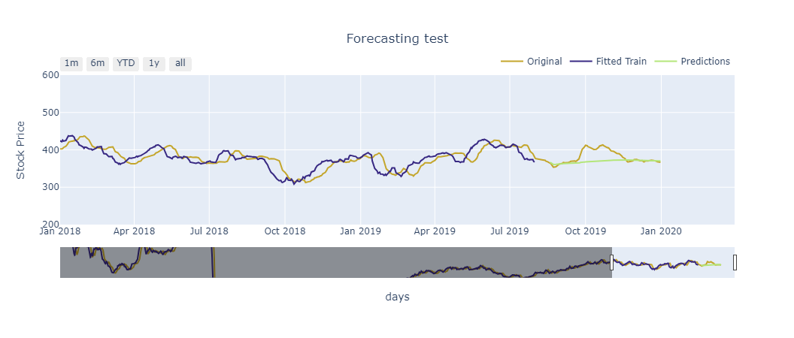

## Multivariate Time-Series for Stock Market Price

The dataset corresponds to stock market price of Maruti Udyog Limited company between 2018 and 2020, one instance for each day from Monday to Friday. I aimed the analysis around Close price, which is the last price when the market closes. I selected 3 features that do not have multicollinearity with 'Close' feature. Therefore my selected features are: 'Close','Turnover' and 'Deliverable Volume'. All data is already stationary, meaning, that I am able to train a multivariate model, in this case a VAR model (Variational Autocorrelation). In order to avoid high oscilations of the stock market price, I smoothed by doing a moving average of 7 days. The following graph represents the Close, High and Low stock market price.

    

 

I checked first, if data is stationary by applying Dickey-Fuller test, then, based on all 3 p-values I check them whether they are under my significance level of 0.05. They are indeed below that threshold, meaning, that we can reject the null-hypothesis and assert stationary data. In order to train a VAR model, I select the optimal lag order considering the lowest AIC criterion. Low AIC denotes a better model fit. I tested the model towards the last 3 months of data in order to compute MAE and MSE metrics.

| Model | Mode | MSE | MAE |
| :---:         |     :---:      |          :---: |:---: |
| VAR   | testing   | 391.587    | 13.417  |

The testing denotes a MAE of 13.42 and knowing the mean of the stock price 380, the error of prediction is around 3.5% of the current price.

    

 

We can observe that fitted values and original data are biased, this is produced by the lags used to train the model. After that, I checked Durbin-Watson statistic to see if residuals  are around 2, meaning that residuals do not follow correlation between them.

Close  : 1.57
Turnover : 2.01
Deliverable Volume : 2.0

I trained again a VAR model with all data available in order to predict the following 90 days. The following graph represents the forecast, which seems fair enough of real stock market price.

    

 
